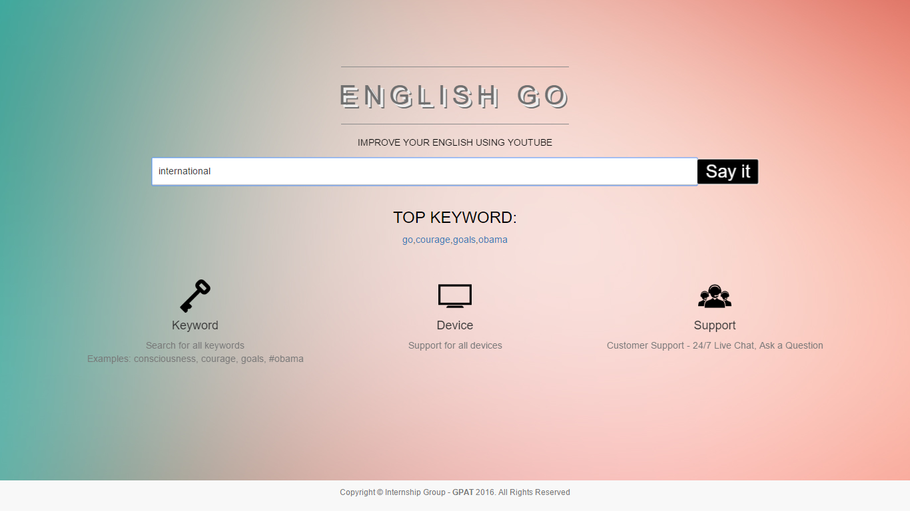
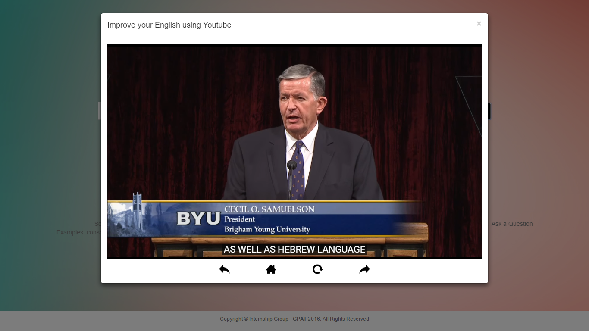
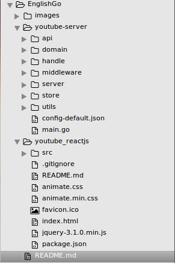

***English Go - Team Intern GPAT 2016***
======================================

English Go will improve your English listen skills with Youtube.
## Geting Started

### Installation
&nbsp;Git clone or download project as zip and use SublimeText in Ubuntu to build and run
## Features
* Friendly interface easy to use<br />
  
* Users can search easily<br />
  
* Enter a keyword to search<br />
  
* Subtitles of Video have contain the keyword been appear<br />
  
* Forward the video to listen<br />
  
* Refresh the page for play again video<br />
  


## Project folder
<br />


## Build with
* Libary Golang <https://www.godoc.org>
* API Google in Golang <https://www.google.golang.org/api/googleapi/transport>
* API Youtube in Golang <https://www.google.golang.org/api/youtube/v3>
* Using Websocket <https://github.com/gorilla/websocket>
* Mux Router <https://github.com/gorilla/mux>
* Package Http in Golang <https://golang.org/pkg/net/http/>
* Package XML in Golang <https://golang.org/pkg/encoding/xml/>

## Back-end Server

### Install dependencies

* Prerequisite
 - a working database connection MongoDB
 - golang toolchain installed and the `go` command in your system $GOPATH.

step 1 Install `source` which will also include the web app

	$ go get github.com/DangHoangThien1995/englishgo

step 2 cd into the web app directory

	$ cd $GOPATH/src/github.com/englishgo

step 3 install dependency

	$ go get github.com/gorilla/mux

step 4 edit `config/app.json` by setting database and database_conn to your values

step 5 run the app

	go run main.go

If you see something like this

	$ utils/load-config: 2016/08/25 18:43:16 Load config from file:  /home/danghoangthien/GOPATH/src/youtube/config-default.json


Then everything is okay, open `http://localhost:3030` in your browser to start writing your web app.
If you experience anything different, redo the steps and make sure you did them in order and with no errors.

```shell
youtube-server
├── api
│   └── apiyoutube
│		└── youtube.go
├── domain
│   └── video.go
├── handle
│   └── controller.go
├── store
│   └── store.go
├── middleware
│   ├── logger.go
│   └── recovery.go
├── server
│   ├── server.go
│   └── setup.go
├── utils
│   ├── loadConfig
│   │	└── loadConfig.go
│   └── logs
│			└── logs.go
├── config-default.json
│		
└── main.go

10 directories, 12 files
```

## Front-End Server


### Install dependencies

```
npm install
```

### Production

```
npm start
```

## Authors
 &nbsp; *Dang Hoang Thien <danghoangthien.hcmus@gmail.com> - Interns at GPAT Company
 &nbsp; *Tran Duc Thanh <tdthanh95@gmail.com> - Interns at GPAT Company
 &nbsp; *Nguyen Hoang Nam <hoangnam2261@gmail.com> - Interns at GPAT Company
# License
&nbsp;This project is licensed under the MIT License

## Feedback

All feedback is welcome. Let me know if you have any suggestions, questions, or criticisms. 
If something is not idiomatic to Go, please let me know know so we can make it better.
